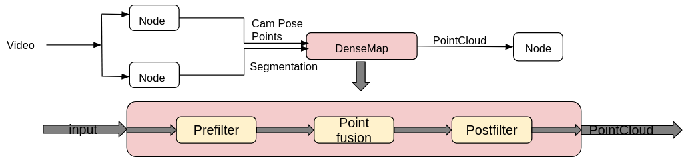

# Intra-Operative Liver Registration
## Introduction

This project is designed to aid surgeons in minimal invasive procedures by refining an intra-operative liver model using laparoscopic data. Leveraging the Robot Operating System (ROS), Point Cloud Library (PCL), and Python, it features ORB SLAM 2 for real-time mapping of the surgical environment. The algorithm translates laparoscopic stereo footage into 3D space by voxelizing it and applying filtering techniques to refine the liver model.

## Architecture Overview
The approach implements a filter pipeline, which consumes the segmentation and camera pose at each frame, applies pre-filters, populates the existing model with new information, and applies further filters. In conclusion, the voxelized, filtered, three-dimensional PointCloud is visualized.

## Demonstration
Illustration of the PointCloud progression after several iterations.

## Contributors

- [@MaDoedel](https://www.github.com/MaDoedel)
- [@DavLei](https://www.github.com/DavLei)